```{r setup, include=FALSE}
knitr::opts_chunk$set(echo = TRUE)
library(dplyr)
library(tinytex)
```

\newpage

# Introduction

FASTAptameR 2.0 is an R-based update of FASTAptamer [@Alam2015]. Like its predecessor, FASTAptameR 2.0 is an open-source toolkit designed to analyze populations of sequences resulting from combinatorial selections. This updated version features a user interface (UI), interactive graphics, more modules, and a faster implementation of the original clustering algorithm.

This user guide walks you through installation and each of the analytical modules, and it highlights what options you have when analyzing your data through the UI. Please see package documentation (**LINK**) for details on running these scripts through R.

## Overview

* **FASTAptameR-Count**
  + *This module is the entry point into FASTAptameR 2.0*
  + Input: preprocessed FASTQ/A
  + Workflow:
    1. count all unique sequences (`Reads`)
    2. sort by counts (`Rank`)
    3. normalize counts as reads per million (`RPM`)
  + Plotting:
    1. line plot of reads-per-rank
    2. histograms of sequence lengths - one for the unique sequences and one for all reads
  + Output: FASTA or CSV
* **FASTAptameR-Translate**
  + Input: counted FASTA
  + Workflow: translate D/RNA sequences to amino acid sequences
  + Plotting:
    1. line plot of reads-per-rank
    2. histograms of sequence lengths - one for the unique sequences and one for all reads
  + Output: FASTA or CSV
* **FASTAptameR-Motif_Search**
  + Input: counted FASTA
  + Workflow: search for user-defined patterns in sequences
  + Output: FASTA or CSV
* **FASTAptameR-Motif_Tracker**
  + Input: two or three counted FASTAs
  + Workflow: track how user-defined patterns enrich across two or three populations
  + Output: CSV
* **FASTAptameR-Distance**
  + Input: counted FASTA
  + Workflow: compute the Levenshtein edit distance (LED) between a single query sequence and all other provided sequences
  + Plotting: histograms of edit distances - one for the unique sequences and one for all reads
  + Output: CSV
* **FASTAptameR-Enrich**
  + Input: two or three counted FASTAs
  + Workflow: calculate how each sequence enriches across two or three populations
  + Plotting:
    1. histogram(s) of `log2(Enrichment)`
    2. scatter plot(s) of RPM
    3. volcano plot of `log2(Enrichment)` and a term related to frequency
  + Output: CSV
* **FASTAptameR-Cluster**
  + Input: counted FASTA
  + Workflow:
    1. filter out low-read sequences based on user-defined input
    2. treat most abundant, non-clustered sequence as cluster seed
    3. add all sequences within a user-defined LED of the seed to the cluster
    4. Repeat until all sequences are clustered or a maximum number of clusters are created
  + Output: FASTA or CSV
* **FASTAptameR-Cluster_Diversity**
  + Input: clustered FASTA
  + Workflow: provide metadata for each cluster
  + Plotting:
    1. metaplots for count of unique sequences, count of total reads, and average LED per cluster
    2. k-mer PCA plot, colored by cluster identity
  + Output: CSV
* **FASTAptameR-Cluster_Enrich**
  + Input: two or three clustered FASTAs
  + Workflow: calculate how each cluster enriches across two or three populations
  + Output: CSV
  
A summary of input and output file types is given by **Table 1**. Please note that each module requires the user to upload a file or, in the case of **FASTAptameR-Count**, optionally provide a GitHub link to the data. At present, none of this data will "live" on the server to be passed between modules.

```{r, echo=FALSE, results='asis'}
knitr::kable(read.csv("./Data/inOut.csv"), caption = "Module Inputs and Outputs", col.names = c("Module", "Input Files", "Output Files"))
```

Many function inputs / outputs are simply FASTA files, so FASTAptameR 2.0 can be easily integrated into most analytical pipelines. Note that *counted* FASTA files are the minimum input (*e.g.*, FASTAptameR-Translate needs *at least* a counted FASTA but could also accept a searched or clustered FASTA file). See **Fig. 1** for a web of all possible module connections.

Importantly, FASTAptameR 2.0 does not provide any functions that are easily addressed by other software (*e.g.*, merging paired-end reads, trimming constant regions, predicting structures, *etc.*). Rather, the focus of this application is to provide flexible downstream analyses for the selections field.

## Example workflows

We show all module connections and two example workflows in **Fig. 1**. *Orange* represents the preprocessed FASTQ or FASTA formatted input file, which we abbreviate as 'FASTQ/A input file'. *Green* represents the entry point into the software and, as such, should be included in all pipelines. *Blue* represents modules that can feed into others. Finally, *red* represents modules that cannot feed into subsequent modules.

Note that all modules will always need a file upload (*i.e.*, data will not 'live' on the web server to be passed between modules).

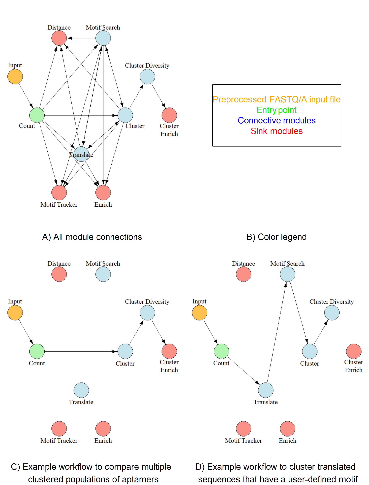

\newpage

# How to get started

Exactly like its predecessor, FASTAptameR 2.0 is designed to be **easy** to use. There are three main ways for users to interact with FASTAptameR 2.0. The *web server* is the easiest way to interact with this application because it only requires an internet connection and browser. However, you can run it locally as a *Docker container*. Finally, this application can be accessed through *R* if you are familiar with the language.

## User interface

### Web Server

This is the easiest way to use the FASTAptameR 2.0 UI. The web server can be accessed from **LINK**, which is hosted by the Digital Biology Laboratory under the direction of Dr. Dong Xu. However, this option only works if the files you need to upload are less than 2 GB.

### Docker

The web server can also be run locally on your machine(s) via Docker. In brief, Docker is a convenient tool that may be used to construct *images* of software. The *image* essentially functions as the blueprint for an application. The *image* of FASTAptameR 2.0, for example, contains all relevant software (*e.g.*, `R`), files (*e.g.*, this PDF), and packages (*e.g.*, `Shiny`). For details on Docker or its installation, please see <https://www.docker.com/> and <https://docs.docker.com/get-docker/>, respectively. 

The FASTAptameR 2.0 *image* must be pulled from a repository (*i.e.*, Docker Hub) by running

|      `docker pull skylerkramer/fastaptamer2:publicupload01`

in a Docker-active terminal. Windows and Mac users will have a Docker-active terminal after proper installation of Docker Desktop. Linux users will have a Docker-active terminal after proper installation of Docker. Windows, Mac, or Linux users can check if their terminal is Docker-active by running 

|      `docker version`

which should indicate which version of Docker has been installed.

Importantly, the FASTAptameR 2.0 *image* is built on Linux. Thus, it is necessary to run it from a Linux environment or virtual machine. For Mac or Windows users, the installation instructions for Docker Desktop (<https://docs.docker.com/get-docker/>) will show you how to do this.

Once you have this application's *image*, running

|      `docker run -d --rm -p 3838:3838 skylerkramer/fastaptamer2:publicupload01`

from a Docker-active terminal will launch a local instance - a *container* - of FASTAptameR 2.0. You will then interact with this *container* in the same fashion as the web server by navigating to `localhost:3838` in your web browser.

**Explanation of flags from the previous command:**

* `-d`: enable detached mode, which allows you to use your command line / terminal even with the active *container* (*i.e.*, *container* is detached from your terminal and runs in the background)
* `--rm`: automatically remove the container upon exit
* `-p 3838:3838`: publish `3838` host port (1st number) to the `3838` container port (2nd number)
* `skylerkramer/fastaptamer2:publicupload01`: the local path to the **FASTAptameR 2.0** Docker *image*
* `localhost:3838`: navigate here from your web browser to start interacting with **FASTAptameR 2.0**

**To recap:**

1. Install Docker on a Linux machine or install Docker Desktop on a Windows or Mac machine to establish a 'Docker-active terminal' on your local system.
2. Pull the FASTAptameR 2.0 image from the Docker Hub repository.
3. Execute the `docker run ...` command and navigate to `localhost:3838` in your web browser.

## R

For experienced R users, all code (UI and modules) can be accessed through GitHub: **LINK**. `install_packages.R` will install all required packages and should be run first. `app.R` and `Functions.R` should be kept in the same directory. The former contains the UI and server code, whereas the latter contains all functions necessary to analyze your data.

The functions from `Functions.R` are available as a GitHub package and can be installed by **INSTALL COMMAND**. For details on usage, see the corresponding documentation: **LINK TO MANUAL**.

## Software usage

If you use, adapt, or modify FASTAptameR 2.0, please cite: **CITATION**.

For any questions or concerns, please email burkelab@missouri.edu or stk7c9@umsystem.edu.

\newpage

# Tutorial

## Data requirements

FASTAptameR 2.0 utilizes many string-based functions in its backend. Thus, this program can be used to analyze many types of biological populations. However, all libraries must be initially saved in a FASTA or FASTQ format and passed through **FASTAptameR-Count** prior to any subsequent analyses. Further, any data preprocessing steps must be made outside of this application.

## Sample Data and Uploading User Data

All data shown in this tutorial come from the 14th and 15th rounds of an aptamer selection against HIV-1 reverse transcriptase [@Burke1996; @Ditzler2013; @Whatley2013]. These data are preprocessed (trimmed and filtered) and available from <http://burkelab.missouri.edu/fastapamer.html>.

To start analyzing the sample data or your own data, please do one of two things. Either **1)** upload a local copy of the file via the file browser in **FASTAptameR-Count** or **2)** supply a link to the data via the text box labeled as `Online source` in **FASTAptameR-Count**. This module is the entry point to **FASTAptameR 2.0**, so each analysis should start here.

## FASTAptameR-Count

### Description

FASTAptameR-Count serves as the entry point into this suite of modules, and, thus, it should be run prior to any of the following modules. This function accepts either a FASTQ/A file chosen with the file browser or a link to such a file (*e.g.*, the default GitHub link in the text box labeled as `Online source`) and returns a *counted* data table as output that can be downloaded as a FASTA or CSV file.

Input FASTQ files should be properly formatted (4 lines per entry with the 2nd line of each entry being the sequence). Input FASTA files are not required to have sequence identifiers. No pre-existing sequence identifiers will be conserved by this module. Instead, output sequence identifiers are defined by the statistical representation of each sequence. Sample input files are shown in **Fig. 2**. A screenshot of the module interface is shown in **Fig. 3**.

```{r, fig.cap='Valid input types', fig.subcap=c('Sample FASTA input without sequence identifiers', 'Sample FASTA input with sequence identifiers', 'Sample FASTQ input'), fig.ncol = 2, out.width="50%", fig.align='center', echo=FALSE}
validInputs <- list.files("Images/ValidInputs/", pattern = ".PNG", full.names = T)
knitr::include_graphics(validInputs)
```


### Usage

The input FASTQ/A file must be chosen with the file browser (**Fig. 3a**) or linked in the text box (**Fig. 3b**). A sample link is already provided in the text box. Note, if a file is uploaded via the file browser **AND** a link is provided, the uploaded file (**NOT** the linked one) will be analyzed. 

The `Start` button will begin the counting process. The results will be displayed as a data table on the right side of the screen. For file uploads, please wait for the loading bar to show *Upload complete* before using the `Start` button.

If you start the module before the upload is finished **AND** a file link is provided, then the file link will be analyzed. If you start the module before the upload is finished **AND** no link is provided, then you will get an error that says `No file or link provided!`. If you start the module before the upload is finished **AND** no file link is provided **AND** you have previously uploaded a file to this module, then the previously uploaded file will be reanalyzed. In any of these cases, reuploading the file, *waiting for it to finish uploading*, and then starting the module should correctly analyze your data. If an error persists (*e.g.*, one that says `Error in nchar()`), please refresh the page.

A sample output data table is shown in **Fig. 4**.

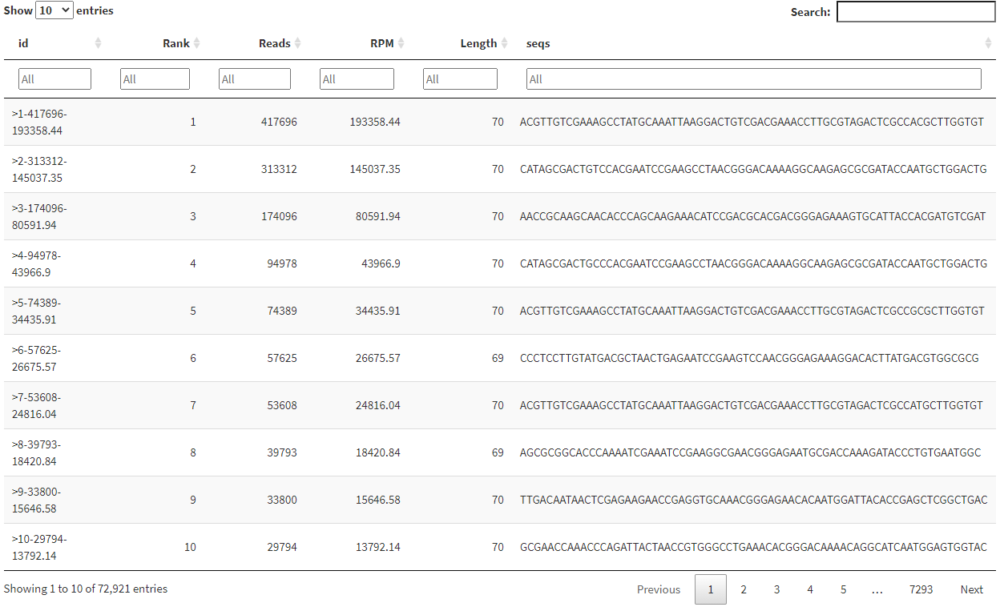

Note that the *id* column has the following format: `>Rank-Reads-RPM`, where `Rank` is the order of sequences after sorting by `Reads`, which is the raw abundance of each sequence. `RPM` - Reads per Million - is the value of `Reads`, normalized by the total population size: `RPM = Reads / (populationSize / 1e6)`.
  
The total number of sequences, number of unique sequences, and module runtime will be displayed below the `Start` and `Download` buttons after running is finished. The `Download` button opens a file browser prior to downloading the output as a FASTA or CSV file (`DEFAULT = FASTA`, which is required for subsequent modules). Keep the *count* file in an easily accessible folder, as this file will serve as input for many other FASTAptameR 2.0 modules.

### Plotting {#countPlot}

This module can also generate two types of interactive plots based on the counted data: a line plot of reads-per-rank (**Fig. 5**) and two histograms of sequence lengths (**Fig. 6**). The line plot is filterable by 1) minimum number of reads to plot and 2) maximum rank to plot. Both values are chosen with a slider bar.

```{r, fig.cap='Reads-per-Rank line plots. Two views of the 70HRT14 data, where panels (A) and (B) include the top 20 and top 100 ranked sequences, respectively. These values are chosen with the corresponding slider bars (shown in Fig. 3).', fig.align = 'center', echo=FALSE, fig.height=8}
# read PNGs and convert to grobs
grob1 <- png::readPNG("./Images/Plots/readsPerRank_min10_max020.png") %>%
  grid::rasterGrob()
grob2 <- png::readPNG("./Images/Plots/readsPerRank_min10_max100.png") %>%
  grid::rasterGrob()

# arrange the grobs
gridExtra::grid.arrange(gridExtra::arrangeGrob(grob1, bottom = "A) Top 20-ranked sequences (min. reads = 10)"),
                        gridExtra::arrangeGrob(grob2, bottom = "B) Top 100-ranked sequences (min. reads = 10)"),
                        ncol = 1)
```

The 1st histogram corresponds to the sequence-length distribution of unique sequences, whereas the 2nd histogram corresponds to the sequence-length distribution of all reads. The histograms are not filterable.

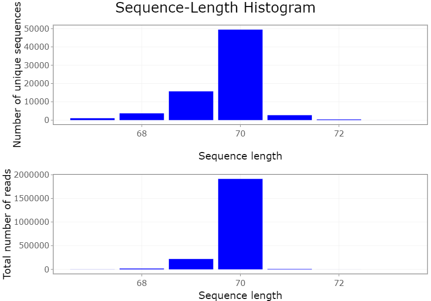

\newpage

## FASTAptameR-Translate

### Description

FASTAptameR-Translate translates input nucleotide sequences into amino acid sequences following the standard genetic code, treating the input nucleotide sequences as positive-sense mRNA. This module accepts a *counted* FASTA file and returns a *translated* data table that can be downloaded as a FASTA or CSV file. A screenshot of the module interface is shown in **Fig. 7**.


### Usage

The input FASTA file must be chosen with the file browser (**Fig. 7a**). The open reading frame may be selected by the 1st set of radio buttons (`DEFAULT = 1`) (**Fig. 7b**). The 2nd set of radio buttons indicates whether nucleotide sequences that encode the same amino acid sequence should be merged (`DEFAULT = Yes`) (**Fig. 7c**). If `Yes`, then redundantly encoded amino acid sequences are converged, and a new column (`Unique.Nt.Count`) will specify how many non-unique nucleotide sequences from the *counted* input were merged into each amino acid sequence. If `No`, then each unique nucleotide sequence is treated separately, even if multiple sequences encode the same amino acid sequence.

The `Start` button begins the translation process. The *translated* data table will be shown on the right side of the screen. The `Download` button opens a file browser prior to downloading the output as a FASTA or CSV file (`DEFAULT = FASTA`, which is required for subsequent modules).

### Plotting

This module generates the same two types of plots as FASTAptameR-Count: a line plot of reads-per-rank and two histograms of sequence lengths. See that [section](#countPlot) for more details.

\newpage

## FASTAptameR-Motif_Search

### Description

FASTAptameR-Motif_Search identifies sequences that contain one or more user-specified sequence motifs, or 'patterns.' The module accepts a *counted* FASTA file and returns a *searched* data table that can be downloaded as a FASTA or CSV file. Sequences in the output must have at least one occurrence of each pattern or at least one occurrence of at least one pattern (see details below for the `partial match` radio button). A screenshot of the module interface is shown in **Fig. 8**.


### Usage

The input FASTA file must be chosen with the file browser. The following text box (**Fig. 8a**) must contain at least one pattern (*e.g.*, `AAA`). If the user wishes to search for multiple patterns, the patterns must be separated by commas (*e.g.*, `AAA,GTG`).

The 1st set of radio buttons (**Fig. 8b**) determines whether the output has parentheses set around identified patterns (`DEFAULT = No`). For example, when `pattern = GGC` and `sequence = AAAGGCT`, the output is `AAA(GGC)T`. Note, when two or more patterns overlap, output only displays parentheses around the first search term that is matched. For example, when `pattern = AGGC,GGCT` and `sequence = AAAGGCT`, the output is `AA(AGGC)T`. Note that parentheses will be treated as individual characters by subsequent modules and may alter downstream analyses. 

The 2nd set of radio buttons (**Fig. 8c**) governs how the software deals with multiple search terms. When the query contains multiple patterns, the search can be carried out either as a Boolean `AND` function by requiring all parts of the query to be present within a given sequence (this is the `default`, with button set to `No`), or as a Boolean `OR` function to identify sequences that contain any part of the query (set button to `Yes`). If `Yes`, filtered sequences must have at least one occurrence of **at least one** of the listed patterns. If `No` (`DEFAULT`), filtered sequences must have at least one occurrence of **each** of the listed patterns.

The 3rd set of radio buttons (**Fig. 8d**) determines the type of pattern (`DEFAULT = Nucleotide`). If `Nucleotide`, then degenerate nucleotide codes are allowed, and T/U are interchangeable. Degenerate search patterns are **not** allowed for other sequence types. Importantly, all patterns are converted to uppercase and have white spaces removed regardless of the pattern type.

1. **A**/**T**/**G**/**C**/**U** - single bases
2. **R** - puRine (A/G)
3. **Y** - pYrimidine (C/T)
4. **W** - Weak (A/T)
5. **S** - Strong (G/C)
6. **M** - aMino (A/C)
7. **K** - Keto (G/T)
8. **B** - not A
9. **D** - not C
10. **H** - not G
11. **V** - not T/U
12. **N** - aNy base (not *gap*)

The `Start` button begins the search process. The *searched* data table will be shown on the right side of the screen. The `Download` button opens a file browser prior to downloading the output as a FASTA or CSV file (`DEFAULT = FASTA`, which is required for subsequent modules).

A sample output data table is shown in **Fig. 9** with the following parameters: `comma-separated patterns = UCCG,CGGGAnAA`, `parentheses = No`, `partial filtering = No`, and `pattern type = Nucleotide`.

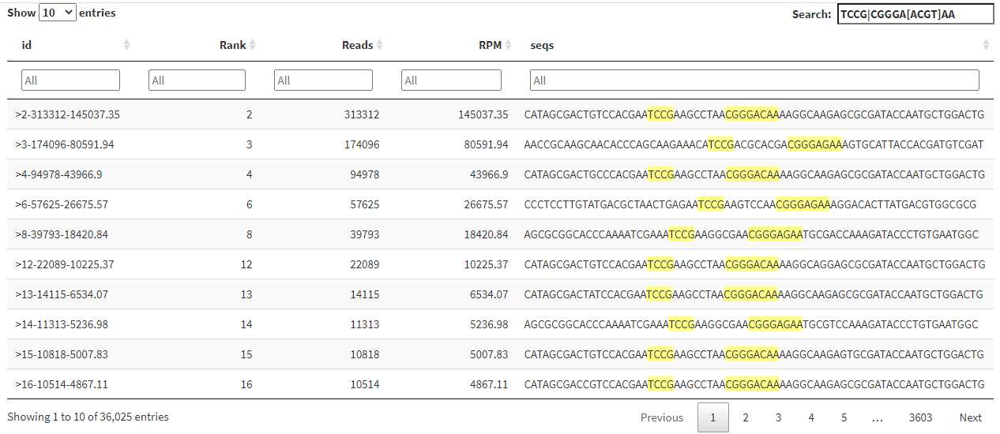

\newpage

## FASTAptameR-Motif_Tracker

### Description

FASTAptameR-Motif_Tracker reports on the occurrence of one or more query patterns across multiple populations. The module accepts two or three *counted* FASTA files as input and returns a data table of metadata related to the enrichment of the query pattern(s) across multiple populations. Multiple FASTA files should be selected from the file browser at the same time. Columns of the output data table include the following: 

1. Input file names
2. Number of unique reads in each population
3. Total number of reads in each population
4. Total number of reads that contain the query pattern(s)
5. RPM of matching sequences
6. Total number of occurrences of the query pattern(s)
7. Total motif RPM

This output can be downloaded as a CSV file and will include appended enrichment scores. A screenshot of the module interface is shown in **Fig. 10**.

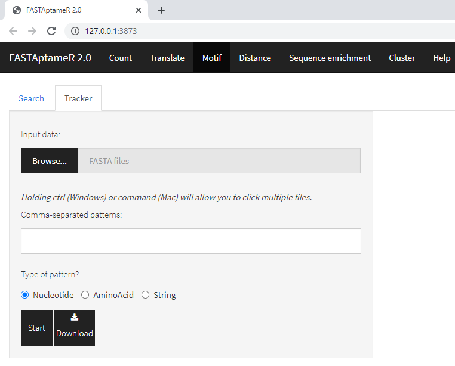

### Usage

The input FASTA files must be chosen with the file browser. The following text box must contain at least one pattern. If the user wishes to search for multiple patterns, the patterns must be separated by commas. The set of radio buttons determines the type of pattern (`DEFAULT = Nucleotide`). If `Nucleotide`, then degenerate nucleotide codes are allowed. Note, the pattern is converted to uppercase and white spaces are removed regardless of the pattern type.

The `Start` button begins the motif enrichment process. The resulting data table will be shown on the right side of the screen. The `Download` button opens a file browser prior to downloading the output as a CSV file. The enrichment scores (`RPM of 2nd file divided by RPM of 1st file, etc.`) are displayed below these buttons. These scores will be included in the downloaded CSV file.

A screenshot of a sample output data table is shown in **Fig. 11** with the following pattern: `UCCGnnnnnnnnCGGGAnAA` (a Family 1 Pseudoknot).

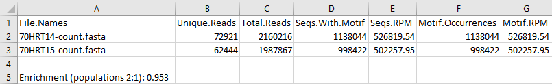

\newpage

## FASTAptameR-Distance

### Description

FASTAptameR-Distance tabulates the distribution of distances from a user-defined reference sequence for all sequences in a population. The module accepts a *counted* FASTA file as input and returns a data table that contains a column for the Levenshtein edit distance (LED) between each input sequence and a query sequence. The output can be downloaded as a CSV. A screenshot of the module interface is shown in **Fig. 12**.

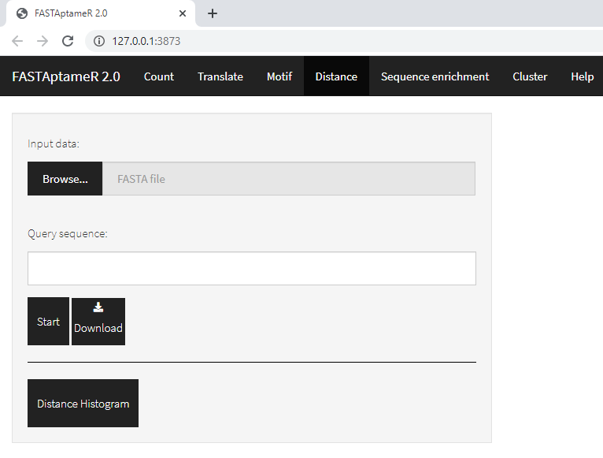

### Usage

The input FASTA file must be chosen with the file browser, and the following text box must contain a single query sequence. Note, this query sequence may not have any degenerate nucleotide codes. The `Start` button begins the distance calculations. The resulting data table will be shown on the right side of the screen. The `Download` button opens a file browser prior to downloading the output as a CSV file.

A sample output data table is shown in **Fig. 13** with the following query sequence (the most abundant sequence from the 70HRT14 dataset):

`ACGTTGTCGAAAGCCTATGCAAATTAAGGACTGTCGACGAAACCTTGCGTAGACTCGCCACGCTTGGTGT`.

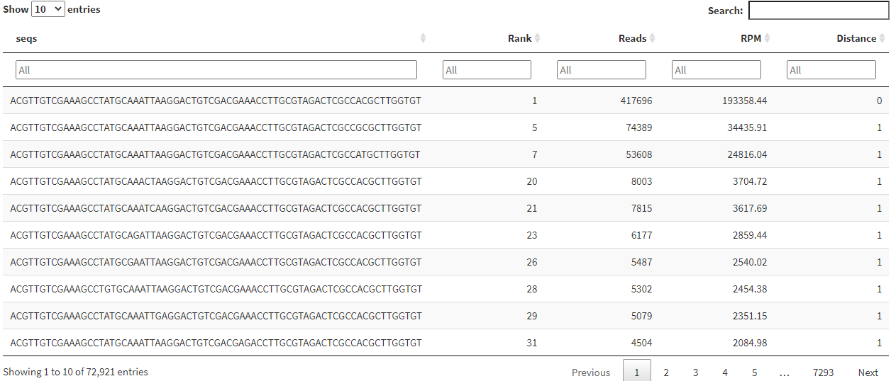

### Plotting

This module can also generate interactive histograms of distances (**Fig. 14**). The top plot corresponds to the distances between the query and unique sequences, whereas the bottom plot corresponds to the distances between the query and all sequences. In both cases, the query sequence is displayed at the top of the plot.

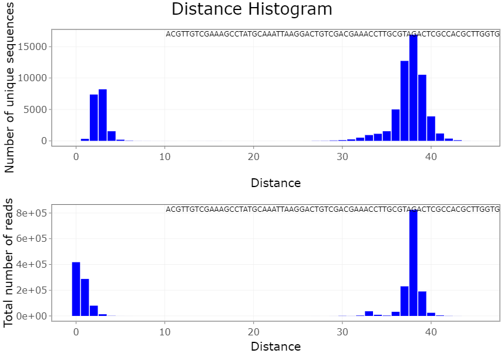

\newpage

## FASTAptameR-Enrich

### Description

FASTAptameR-Enrich calculates the enrichment (or depletion) of each sequence in one population relative to other populations. The module accepts two or three *counted* FASTA files as input and returns a single data table after merging by sequences. Column headers for output data correspond to sequences from the 1st, 2nd, and optional 3rd file and are appended with *.x*, *.y*, and *.z*, respectively. Additional columns include enrichment scores ("Enrichment" = `RPM2 / RPM1`) and the base-two logarithm of the Enrichment ("log2(E)" = `log2(Enrichment)`). The order of comparisons are `y:x`, `z:y`, and `z:x`. This output can be downloaded as a CSV.

A screenshot of the module interface is shown in **Fig. 15**.

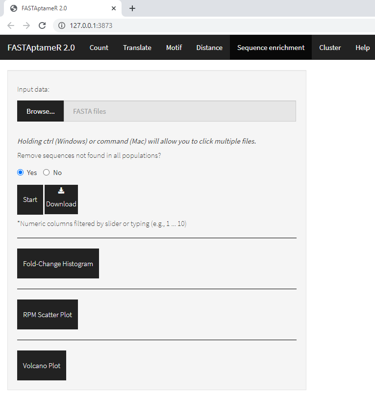

### Usage

The input FASTA files must be chosen with the file browser. The following set of radio buttons determine whether missing values are allowed in the output. Missing values result from sequences that are only present in a subset of the input files.

The `Start` button begins the enrichment calculations, and the resulting data table will be shown on the right side of the screen. All numeric columns in this data table are filterable by typing into the corresponding text box (*e.g.*, `1 ... 10` to keep values in the range `[1:10]`) or by using the slider bar that is displayed after clicking in the corresponding text box. Note, these filters apply the mask only to the displayed data, so calculations will **not** be repeated when the filters are altered. To display all data again, delete the filters from the text boxes.

The `Download` button opens a file browser prior to downloading the output as a CSV file. A sample filtered output data table is shown in **Fig. 16**.

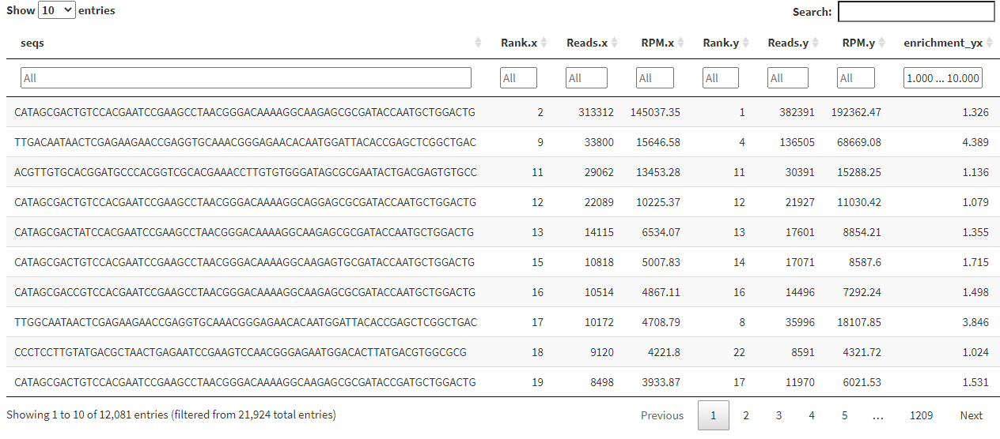

### Plotting

This module can generate three types of interactive plots: $\log_{2}(Enrichment)$ histograms (one per comparison - **Fig. 17**), RPM scatter plots (a 2D plot for two populations - **Fig. 18** - or a rotatable 3D plot for three populations - *not shown*), and volcano plots (one per comparison - **Fig. 19**).

The spread of the $\log_{2}(Enrichment)$ histogram relative to a vertical line at `x = 0` can indicate the magnitudes of enrichment (or depletion), while displacement of the centroid of the distribution from this line can indicate possible directionality of the population's evolution.

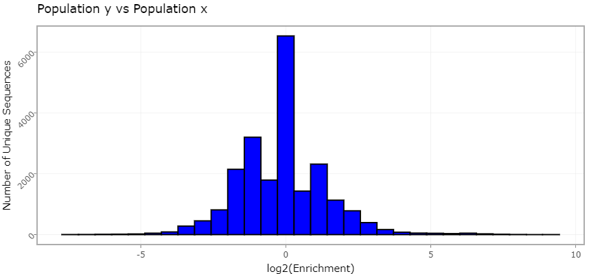

Similarly, the spread of the RPM scatter plot relative to the diagonal line at `y = x` can also indicate the magnitudes of enrichment and possible directionality.

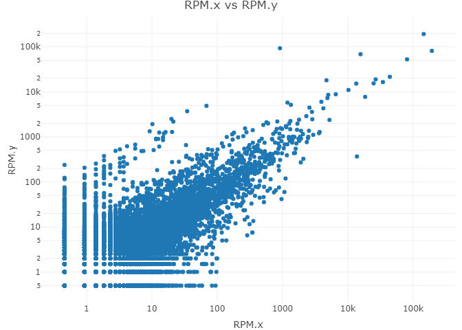

The volcano plot is used to show the relationship between the respective $\log_{2}(Enrichment)$ and number of reads for each sequence, which is an indication of the statistical strength of the observed ratios. Specifically, for the purposes of this module, the y-axis is given by $y(seq) = \sqrt{\log_{2}(seq.Reads) / log_{2}(Total.Reads})$, based on the fact that the variance of sample count for a species from a resampled population varies with the square root of the number of times a given species is resampled.

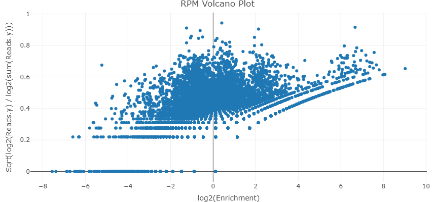

\newpage

## FASTAptameR-Cluster

### Description

FASTAptameR-Cluster groups sequences according to sequence relatedness for all sequences in the population within a user-defined threshold of similarity. The module accepts a *counted* FASTA file as input. If no output directory is specified (the default setting), the module returns a *clustered* data table to the screen. This data table contains all sequences and clusters and can be downloaded as a single FASTA or CSV file. If an output directory is specified, then no data table will be created, and one FASTA file per cluster will be written to the output directory.

Briefly, the module identifies clusters in an iterative manner. During each iteration, the most abundant sequence that has not yet been clustered becomes a cluster "seed" for that iteration. Any other sequences that have not yet been clustered and that are within a user-defined edit distance of this seed sequence are added to this cluster. This process repeats until all sequences are clustered or a predefined number of clusters is created.

A screenshot of the module interface is shown in **Fig. 20**.


### Usage

The input FASTA file must be chosen with the file browser. The 1st slider bar (**Fig. 20a**) sets the minimum number of reads a sequence must have to be clustered (`DEFAULT = 10`). Sequences with fewer reads are removed prior to clustering. The 2nd slider bar (**Fig. 20b**) sets the maximum Levenshtein edit distance to consider between a seed sequence and all other sequences (`DEFAULT = 7`). The 3rd slider bar (**Fig. 20c**) sets the total number of desired clusters (`DEFAULT = 20`). Note, any remaining sequences will be grouped as `NC` ("not clustered").

The 1st set of radio buttons (**Fig. 20d**) indicates whether non-clustered sequences should be kept (`DEFAULT = No`). If `Yes` then the sequence IDs of non-clustered sequences will be appended with `NC`.

The 2nd set of radio buttons (**Fig. 20e**) indicate whether each cluster should be written to a different FASTA file (`DEFAULT = No`). If `No`, then all clusters are grouped together and downloaded in a single file. If `Yes`, then each cluster will be written to its own FASTA file, and no data table will be displayed. Note, a directory path **must be copied or typed** into the corresponding text box (**Fig. 20f**) if this option is `Yes`.

The `Start` button will begin the clustering process. The results will be displayed as a data table on the right side of the screen. The `Download` button opens a file browser prior to downloading the output as a FASTA or CSV file (`DEFAULT = FASTA`, which is required for subsequent modules).

Algorithm progress will be shown below these buttons and will update after each cluster finishes. These notifications occur regardless of whether the module is writing to one or many files.

A sample output data table is shown in **Fig. 21**.

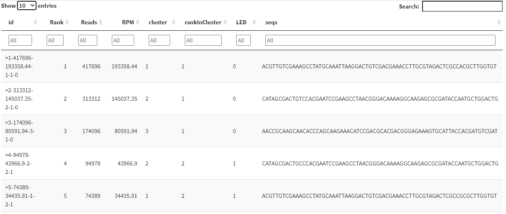

Note that the new *id* column is the old *id* with three new values appended to the end: `Cluster Number`, `Rank in Cluster`, and `Distance to Cluster Seed`.

\newpage

## FASTAptameR-Cluster_Diversity

### Description

FASTAptameR-Cluster_Diversity evaluates diversity across the *clustered* population and sequence relationships within and between clusters. The module accepts a *clustered* FASTA file as input and returns a data table with metadata for each cluster. This data table can be downloaded as a CSV file.

A screenshot of the module interface is shown in **Fig. 22**.


### Usage

The input FASTA file must be chosen with the file browser. The `Start` button begins the analysis. The results will be displayed as a data table on the right side of the screen and include the following columns: `Cluster Number`, `Seed Sequence`, `Total Sequences`, `Total Reads`, and `Total RPM`. The `Download` button opens a file browser prior to downloading the output as a CSV file, which can be used by FASTAptameR-Cluster_Enrich. A sample output data table is shown in **Fig. 23**.

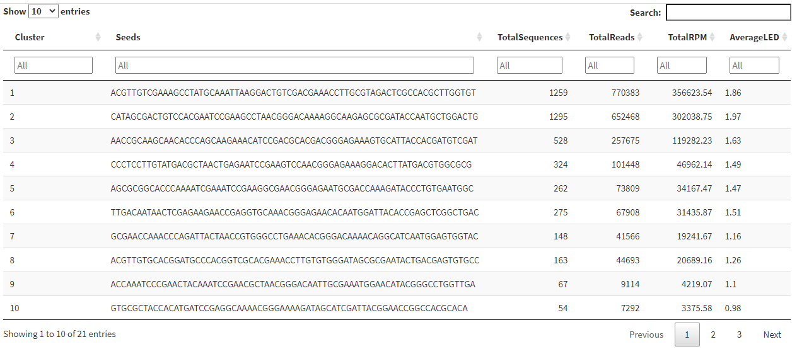

### Plotting

This module can generate metaplots of the analyzed data (**Fig. 22a**). These line plots correponds to the number of unique sequences per cluster, total reads per cluster, and average LED to seed sequence per cluster (**Fig. 24**).

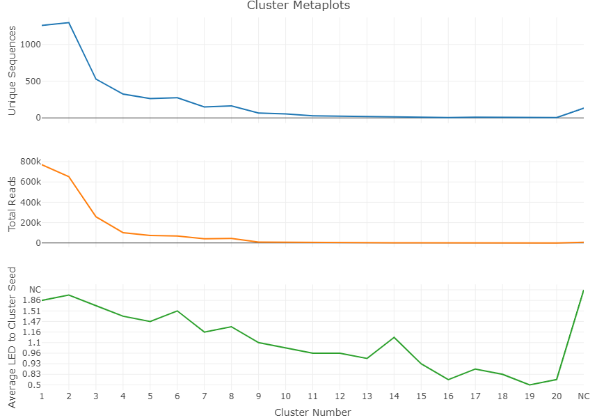

This module is also able to analyze clusters by converting all sequences into k-mer vectors and rendering an interactive 2D PCA plot (**Fig. 22b**), colored by cluster (**Fig. 25**). The value of `k` can be chosen with the 1st set of radio buttons (**Fig. 22c**) (`DEFAULT = 3`). The slider bar (**Fig. 22d**) indicates how many of the top clusters should be plotted (max = 21 clusters due to graphics limitations). The 2nd set of radio buttons (**Fig. 22e**) indicates whether non-clustered (`NC`) sequences should be plotted (`DEFAULT = Yes`). Note that non-clustered (`NC`) sequences in the output are marked as `NA` in this plot. 

Importantly, only nucleotide sequences without ambiguities should be plotted in this module. The large k-mer matrix needed for peptide sequences may return errors related to memory usage. Further, this module will reject any set of sequences with characters outside of `[A, C, G, T/U]`. The resulting k-mer PCA plot will not display anything.

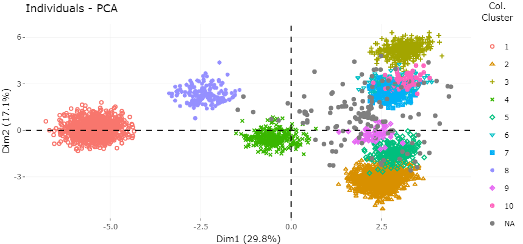

\newpage

## FASTAptameR-Cluster_Enrich

### Description

FASTAptameR-Cluster_Enrich calculates the enrichment (or depletion) of each cluster in one population relative to other populations. The module accepts two or three *cluster-analysis* CSV files as input and returns a data table after merging by `Seed Sequence`. Thus, this module assumes that cluster seeds are consistent across populations, though this may not always be a valid assumption.

The output data table includes a column for `Enrichment` that can be downloaded as a CSV file. A screenshot of the module interface is shown in **Fig. 26**.


### Usage

The input FASTA files must be chosen with the file browser. The `Start` button begins the enrichment calculation. The results will be displayed as a data table on the right side of the screen and include a column for `Enrichment`. The `Download` button opens a file browser prior to downloading the output as a CSV file.

A sample output data table is shown in **Fig. 27**.

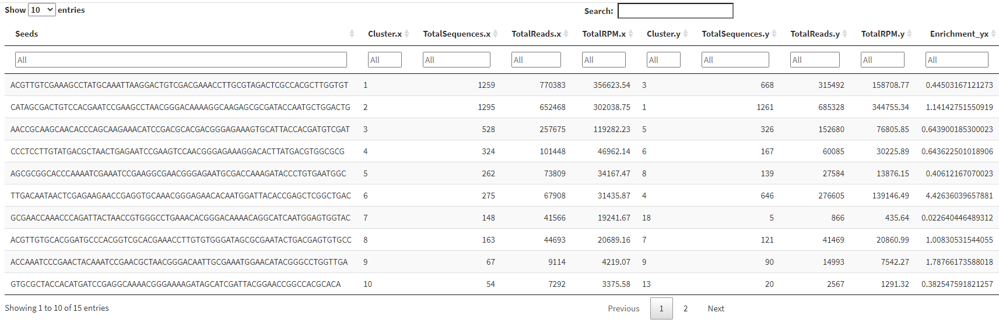

Note that columns 3-5 and 7-9 refer to *total* values in the given cluster.

\newpage

# Version history

\newpage

# References